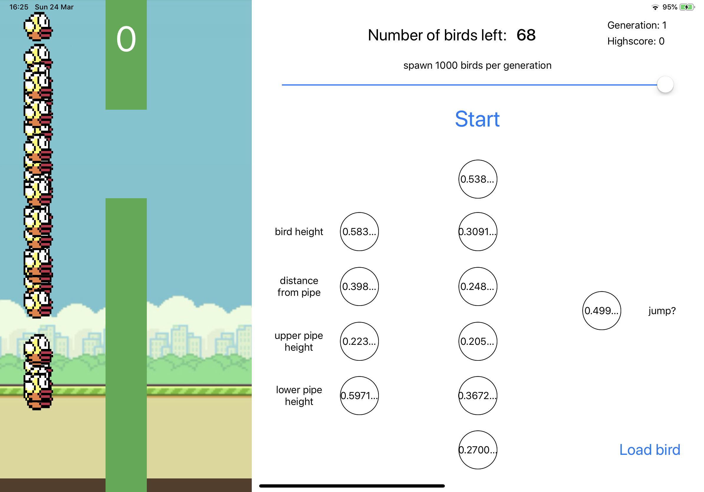

# Flappy Bird Neural Network
This project is a clone of the popular mobile game 'Flappy Bird', but a version that teaches itself to play through the use of a neural network and the genetic algorithm.

### How-to
- use the slider to choose the amount of birds to spawn per generation (recommended 1,000)
- tab the 'Start' button
- watch as the birds become progressively smarter!

### Known bugs
- occasionally the game will go on forever after all birds have died
- the learning process is not 100% reliable, sometimes you may have to restart the app a few times before they start becoming smarter

#### Note - this app was built to run on the iPad Pro 11" screen size, so if you're using another device you'll have to adjust the constraints and overall UI layout
